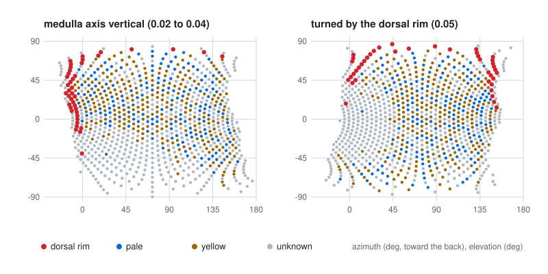

# The two compound eyes

A fly sees through two compound eyes of several hundred ommatidia each; every ommatidium looks in one direction and
feeds one column of the optic lobe. `flycns.eyes` builds both eyes over the columns the release actually mapped, so
that light entering the model eye reaches the real neurons of the right column.

## What is real, what is derived, what is modelled

| Part | Where it comes from | Status |
|---|---|---|
| The columns of each eye: 879 left, 892 right, with their two hexagonal coordinates | the MaleCNS annotations | real |
| The photoreceptors and lamina neurons of each column; pale, yellow and dorsal-rim columns | compiled from the release's connectivity | real, derived |
| Which offsets are neighbours, and the lattice's handedness (the chiasm) | measured on the release (below) | real, derived |
| Which lattice direction is vertical in the eye | set by the dorsal rim, confirmed by T4 motion tuning (below) | real, derived |
| Each column's viewing direction | a model, scaled to the eye's measured extent | modelled, stated |
| Each ommatidium's acceptance | a Gaussian with the measured dark-adapted width | modelled from a measurement |

## Measuring the lattice on the release

The release labels every medulla synapse with its column (`ME_R_col_12_29`) and every synapse with its neuropil. One
pass over the 13 GB synapse table gives (i) the 3D centre of every medulla column and (ii) the centroids of landmark
neuropils. The landmarks give the body axes: **left** from the right medulla to the left one; **anterior** from the
mushroom-body calyces to the antennal lobes; **dorsal** from the gnathal ganglia to the protocerebral bridge, each
made orthogonal to the previous ones. Measured on MaleCNS v1.0 (release frame): left = (0.999, -0.030, -0.019),
anterior = (0.004, 0.619, -0.785), dorsal = (-0.035, -0.785, -0.619), a right-handed frame.

A least-squares fit of the column centres,

$$\mathbf{c}(h_1, h_2) \approx \mathbf{c}_0 + h_1\,\mathbf{e}_1 + h_2\,\mathbf{e}_2,$$

gives the 3D step $\mathbf{e}_k$ of each hex axis. Measured (right eye, micrometres): $\mathbf{e}_1$ has anterior
component $-5.05$ and dorsal $+0.64$ (it runs posterior), $\mathbf{e}_2$ has anterior $-0.54$ and dorsal $+6.20$ (it
runs dorsal); the left eye matches. The six nearest columns of each column, tallied, give the neighbour offsets
$(\pm1, 0)$, $(0, \pm1)$ and $\pm(1, 1)$ in both eyes.

## From the medulla to the eye

**The chiasm.** Between the lamina and the medulla, the first optic chiasm crosses the fibres horizontally: the
anterior-posterior order of columns is mirrored, the dorsal-ventral order kept. So the hex axis that runs posterior in
the medulla belongs to ommatidia that look further **forward**.

**The ideal lattice.** In the eye the lattice is taken regular. Because $(1, 1)$ is a neighbour offset, the two
axes sit 120 degrees apart, so their sum is also one step. Laid out first with $h_2$ vertical,

$$\mathbf{p}_0(h_1, h_2) = h_1 \begin{pmatrix} \cos 30^\circ \\ -\sin 30^\circ \end{pmatrix} + h_2 \begin{pmatrix} 0 \\ 1 \end{pmatrix}
\quad\text{(forward, up), in steps.}$$

**Which direction is vertical.** The medulla sits obliquely in the head, so the axis that runs dorsally in the
medulla ($h_2$) need not run vertically in the eye, and it does not. The dorsal rim settles it: its columns, known
from their photoreceptor subtypes and not from geometry, form the band along the top edge of the eye. The lattice is
turned by the multiple of 60 degrees that puts the rim's centroid straight above the eye's centre,
$\mathbf{p} = R(k \cdot 60^\circ)\,\mathbf{p}_0$. A turn by a multiple of 60 degrees maps the ideal lattice onto
itself, so only the choice of the vertical direction changes, and the chiasm's handedness is kept. On MaleCNS v1.0
the rim's centroid sits at a bearing of 42 degrees (left eye) and 37 degrees (right) from the forward axis with $h_2$
vertical, and at 102 and 97 degrees after a turn of 60 degrees in both eyes: the vertical direction of the eye is the
diagonal $(1, 1)$, not $h_2$.

Versions 0.02.000 to 0.04.000 kept $h_2$ vertical, and their dorsal-rim check (the rim above the colour columns on
average) passed anyway, because a lattice turned by 60 degrees still leaves the rim high. The error surfaced when
T4 cells, measured on the real wiring through these eyes, preferred the four known directions all turned by about
+65 degrees in both eyes; after the correction they prefer them within about 10 degrees
([`04_optic_lobe.md`](04_optic_lobe.md)). The rim alone sets the turn; T4 is an independent confirmation, not an
input.

<picture>
  <source media="(prefers-color-scheme: dark)" srcset="../assets/eyes-orientation-dark.svg">
  
</picture>

The figure is drawn from the model by `scripts/figures/eyes_figure.py`.

**Placement on the sphere.** The equator is the median row (as many columns above as below; an assumption). The
columns within half a step of the equator span, in the measurements of Zhao et al. (*Nature* 646:135-142, 2025,
doi:[10.1038/s41586-025-09276-5](https://doi.org/10.1038/s41586-025-09276-5)), from 10 degrees into the opposite
hemisphere in front to 155 degrees behind. That fixes the step angle:

$$\Delta\varphi = \frac{155^\circ - (-10^\circ)}{p_{\text{front}} - p_{\text{back}}}.$$

Each column is then placed at angular distance $\rho = \Delta\varphi\,\lVert \mathbf{p} - \mathbf{p}_c \rVert$ from the
eye's centre direction (azimuth 72.5 degrees, elevation 0) along the lattice bearing (an azimuthal-equidistant
placement). Radial distances from the centre are exact; tangential spacing at distance $\rho$ is compressed by
$\sin\rho / \rho$ (0.69 at the ends of the equator). Real eyes also vary their spacing across the eye, flatter in the
centre than at the edges (Zhao et al. 2025); the model's variation is a consequence of the placement, not a
measurement.

## The eyes this gives for MaleCNS v1.0

| Quantity | Left | Right |
|---|---|---|
| Columns | 879 | 892 |
| Implied inter-ommatidial angle $\Delta\varphi$ | 5.60 deg | 5.44 deg |
| Neighbour spacing, median (5th to 95th percentile) | 5.29 deg (4.13 to 5.60) | 5.15 deg (4.05 to 5.44) |
| Farthest look past the midline, any column | 33.7 deg | 24.5 deg |
| Dorsal-rim columns: mean elevation; bearing of their centroid from the centre (90: straight up) | 63.5 deg; 81 deg | 59.3 deg; 86 deg |
| Pale and yellow columns, mean elevation | -2.9 deg | 2.6 deg |

The implied $\Delta\varphi$ of 5.4 to 5.6 degrees is close to the smallest measured inter-ommatidial angle of the
Drosophila eye, 4.5 degrees in its lateral part (Gonzalez-Bellido, Wardill and Juusola, *PNAS* 108:4224, 2011,
doi:[10.1073/pnas.1014438108](https://doi.org/10.1073/pnas.1014438108)). The dorsal-rim columns, identified only from
their photoreceptor subtypes, sit about 60 degrees above the colour columns, which lie on the equator. Off the
equator the eyes look further past the midline in front than the less than 20 degrees of binocular overlap Zhao et
al. measured: the equidistant placement stretches the frontal edge, which the model states and does not correct.

## Sampling a scene

A scene arrives as an equirectangular panorama in the body frame. Each ommatidium integrates it with a Gaussian
acceptance of full width at half maximum $\Delta\rho$, weighted by each pixel's solid angle and normalised:

$$L_i = \frac{\sum_k w_{ik} I_k}{\sum_k w_{ik}}, \qquad
w_{ik} = \exp\!\left(-\frac{\theta_{ik}^2}{2\sigma^2}\right)\cos\phi_k\,\Delta\lambda\,\Delta\phi,
\qquad \sigma = \frac{\Delta\rho}{2\sqrt{2\ln 2}},$$

with $\theta_{ik}$ the angle between ommatidium $i$'s direction and pixel $k$, $\phi_k$ the pixel's latitude, and
$\Delta\rho$ = 8.23 degrees, the measured dark-adapted half-width of R1-R6 (Gonzalez-Bellido et al. 2011). Weights
beyond three sigma are dropped. Ground truth (depth, object labels) is read under each ommatidium's central ray and,
where an acceptance-weighted value is wanted, through the same weights, so input and truth are sampled identically.

## Assumptions and limits

- Directions are modelled; the real lens map of this animal was not imaged. The extent comes from other flies (three
  females in Zhao et al.); the equator is the median row.
- One inter-ommatidial angle for the whole lattice; spacing then varies only through the placement.
- One acceptance width for all photoreceptors and all light levels (the dark-adapted value; light adaptation narrows
  it).
- Luminance only. Pale and yellow columns are recorded so a spectral model can be added; none is claimed here.
