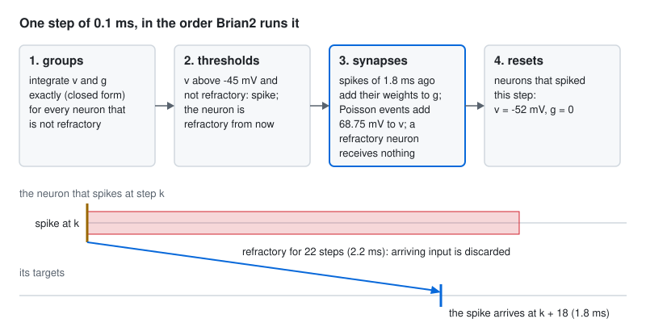

# The whole-brain spiking model

`flycns.dynamics` runs the leaky integrate-and-fire model of Shiu et al. (*Nature* 634:210-219, 2024,
doi:10.1038/s41586-024-07763-9) on a compiled connectome: every neuron a point neuron with the same constants, every
connection weighted by its synapse count and the sign of its presynaptic neuron. The paper built it on the FlyWire
brain and checked it against experiments ("Across 164 predictions we were able to test empirically, 91% were
consistent with our empirical results"). Here it runs on MaleCNS v1.0, brain and nerve cord together, and a literal
Brian2 transcription of the published program is the test that it is the same model.

## What is real, what is modelled

| Part | Where it comes from | Status |
|---|---|---|
| Which neurons connect, and with how many synapses | the compiled MaleCNS v1.0 (25,582,938 connections, 124,177,617 synapses) | real |
| The sign of each neuron's output | its predicted transmitter, by the published rule (histamine inhibitory for the photoreceptors) | real, derived |
| The neuron: leaky integration, threshold, reset, refractoriness, one exponential synapse | Shiu et al. 2024, `model.py` | modelled, published |
| The constants | the published values, which the code attributes to Kakaria and de Bivort 2017 (potentials, membrane time), Juergensen et al. (synaptic time), Lazar et al. (refractory period) and Paul et al. 2015 (delay) | published |
| One synapse's weight, $w_\text{syn} = 0.275$ mV | the model's single free parameter, fitted by the authors | published |

The published limits apply unchanged: identical point neurons, no morphology, no receptor dynamics, no gap junctions,
no non-spiking neurons, no neuromodulation or internal state, no firing without input.

## The equations

Each neuron $i$ has a membrane potential $v_i$ and a synaptic variable $g_i$:

$$\tau_m \frac{dv_i}{dt} = v_0 - v_i + g_i, \qquad \tau \frac{dg_i}{dt} = -g_i,$$

both frozen while the neuron is refractory. When $v_i > v_\text{th}$ the neuron spikes, is reset to
$v_i \leftarrow v_\text{rst}$, $g_i \leftarrow 0$, and stays refractory for $t_\text{rfc}$. A spike of neuron $j$
reaches each target $i$ after the delay $t_\text{dly}$ and adds

$$w_{ij} = s_j\, n_{ij}\, w_\text{syn}$$

to $g_i$, where $s_j \in \{-1, 0, +1\}$ is the sign of $j$ and $n_{ij}$ the number of synapses from $j$ onto $i$.

| Constant | Value | | Constant | Value |
|---|---|---|---|---|
| $v_0$ (rest) | -52 mV | | $\tau$ (synapse) | 5 ms |
| $v_\text{rst}$ (reset) | -52 mV | | $t_\text{rfc}$ (refractory) | 2.2 ms |
| $v_\text{th}$ (threshold) | -45 mV | | $t_\text{dly}$ (delay) | 1.8 ms |
| $\tau_m$ (membrane) | 20 ms | | $w_\text{syn}$ | 0.275 mV |
| $\Delta t$ | 0.1 ms | | $f_\text{poi}$ | 250 |

**Exact integration.** Between events the pair is a linear system, so each step applies its closed form, which is
what Brian2's `linear` method computes:

$$g(t+\Delta t) = g\,e^{-\Delta t/\tau}, \qquad
v(t+\Delta t) = v_0 + (v - v_0)\,e^{-\Delta t/\tau_m} + g\,\frac{\tau}{\tau - \tau_m}
\left(e^{-\Delta t/\tau} - e^{-\Delta t/\tau_m}\right).$$

A single synaptic input $g_0$ therefore moves the membrane by at most
$g_0\,\frac{\tau}{\tau_m - \tau}\left(e^{-t^*/\tau_m} - e^{-t^*/\tau}\right)$ at
$t^* = \frac{\tau \tau_m}{\tau_m - \tau}\ln\frac{\tau_m}{\tau} \approx 9.2$ ms, about 0.16 of $g_0$: a neuron needs
roughly $7 / (0.16 \times 0.275) \approx 160$ coincident excitatory synapses to reach threshold from rest.

## One step, in the order the published program runs it

<picture>
  <source media="(prefers-color-scheme: dark)" srcset="../assets/lif-step-dark.svg">
  
</picture>

The published model is a Brian2 program, so its step is Brian2's default schedule:

1. **groups**: $v$ and $g$ advance by the closed form, for the neurons that are not refractory;
2. **thresholds**: a neuron that is not refractory and has $v > v_\text{th}$ spikes, and is refractory from now on;
3. **synapses**: spikes emitted $t_\text{dly}$ ago (18 steps) add their weights to $g$, and Poisson events add to $v$,
   **only for neurons that are not refractory**;
4. **resets**: the neurons that spiked this step get $v \leftarrow v_\text{rst}$, $g \leftarrow 0$.

**A refractory neuron discards its input.** In the published equations both variables are declared
`(unless refractory)`, and for such variables Brian2 applies a synaptic update only to targets that are not
refractory; the code it generates for `v += w` reads `add.at(v, post[not_refractory], w[not_refractory])`. Input that
reaches a neuron during its 2.2 ms of refractoriness is lost, not stored in the frozen $g$ for later. The first
transcription here stored it, and the parity test caught the difference at the tenth spike of the first circuit.

## Activation and silencing

**Activation** is the paper's optogenetic stand-in: independent Poisson events at a rate $r$ (150 Hz in the paper's
experiments) add $w_\text{syn} f_\text{poi} = 68.75$ mV to $v$, so a single event lifts a neuron from rest to
16.75 mV and it spikes on the next step. Activated neurons have no refractory period, as in `model.py`
(`neu[i].rfc = 0 * ms`), so they can spike every other step.

**Silencing** is the paper's `silence()`: every synapse *from* the neuron gets weight zero
(`syn.w['{i} == i'] = 0`, where `i` is the presynaptic index). The silenced neuron still receives input and still
spikes; its spikes reach no one. It can be given through the weights (`synaptic_weights(..., silenced=...)`) or
through the drive (`Drive.silenced`, which drops the neuron's spikes before delivery), and the two give the same run.

## Randomness that every implementation reproduces

A Poisson event for neuron $i$ at step $k$ occurs when

$$h(\text{seed};\, i, k) < \left\lfloor r\,\Delta t\, 2^{32} \right\rfloor,$$

where $h$ is MurmurHash3_x86_32 (Austin Appleby, public domain) of the 8-byte little-endian key $(i, k)$, seeded with
the run's seed. The hash is built from 32-bit multiplies, adds, xors, shifts and rotations, so JavaScript
(`Math.imul`, `>>> 0`) and WGSL (`u32` arithmetic wraps) compute it exactly as NumPy does, and any MurmurHash3
implementation is an oracle for it (the tests check 200 random keys against the `mmh3` package, and pin five
vectors that the TypeScript and WGSL implementations must reproduce). An event stream needs no generator state: any
neuron at any step, in any order, on any device, gives the same events. Measured: the long-run rate is the requested
one, consecutive steps are uncorrelated, and both the per-step count across neurons and the per-neuron count across
steps have a dispersion index of 1, as independent events must.

## Two engines

| Engine | Arithmetic | Delivery | Determinism |
|---|---|---|---|
| `LIFReference` (NumPy) | float64 | the rows of the spiking neurons, accumulated with `bincount` in a fixed order | a pure function of (graph, drive, seed) |
| `LIFTorch` (PyTorch, CUDA or CPU) | float32 | the same rows, pushed with `index_add_` | compared by tolerance, never claimed bit-identical |

Both engines push each spike along its presynaptic row, so the cost of a step follows the activity, not the
25.6 million connections. On the whole MaleCNS with the moderate drive below, one second of model time takes about
14 s on the NumPy engine and 18 s on the PyTorch engine (a laptop RTX 4070 shared with another process; at this
activity the GPU engine is bound by kernel launches, not by arithmetic).

## What the model does on the whole male CNS

Two drives are used throughout the tests. The **moderate** drive activates the 57 gustatory neurons of types
LB1a-LB1e at 150 Hz; the **strong** one activates all 1,428 neurons of the gustatory class at 150 Hz.

- Moderate drive, first 200 ms: 5,120 neurons fire 18,063 spikes, the same neurons the same number of times on
  both engines. Individual spike times part after about 6,300 spikes (around 110 ms), once float32 and float64 first
  decide a threshold differently; the per-50 ms totals stay equal for 300 ms.
- The network has **two states**. In the low one it fires about 8,000 spikes per 50 ms. At a random moment it can
  switch into a high one of about 44,000 per 50 ms, carried by the central brain, with the mushroom-body output and
  dopaminergic neurons (MBON11, PPL101) among the most active. Under the moderate drive the float32 run switched at
  about 800 ms and the float64 run had not switched by 1 s; the moment is a property of each trajectory.
- Strong drive, 500 ms, ten seeds on the reference: 269,642 to 522,875 spikes, from no switch (about 0.27 million) to
  an early one (about 0.52 million).

This matches the "silence or seizure" behaviour the flyverse project reports for the published model on a whole CNS
with sensory input. flycns runs the published model as published; stabilisers, when added, are a separate labelled
mode that is off by default (the design document, section 5).

**What agreement means, then.** Float32 and float64 runs share every input event but part at the first threshold the
two arithmetics decide differently, and from then on they are two samples of one process. So over 200 ms of the
moderate drive the GPU engine must fire the same neurons the same number of times (active-neuron Jaccard index and
count correlation of at least 0.99; measured 1.0 and 1.0000). Under the strong drive its trials must look like
trials of the reference: the mean rates of five GPU trials, against five independent reference trials, must
correlate at least at the 5th percentile of the reference against itself over the 126 ways of splitting ten seeds in
two. Measured: 0.991, where the reference's own splits range from 0.778 to 0.996, with a 5th percentile of 0.891 and
a median of 0.983.

## Null graphs

A result on the connectome means something only against the same model on graphs that lack what the connectome has.
`flycns.nulls` builds three, each a new CSR with the same number of connections, deterministic in its seed:

- **N1, degree-preserving rewiring** (in the spirit of Maslov and Sneppen, *Science* 296:910-913, 2002,
  doi:10.1126/science.1065103). Within each partition block (a pair of pre and post partitions among the left and
  right optic lobes, the central brain and the nerve cord) the targets of the block's connections are permuted, so
  every connection keeps its presynaptic neuron, its sign and its count, and every neuron its in-degree and
  out-degree. A permutation creates self connections and repeated pairs; each is repaired by exchanging its target
  with that of a random connection of the same block, accepted only when both new pairs are absent from the graph and
  from every other exchange of the round, so a repair never creates a collision. On MaleCNS (seed 0) the permutation
  creates 306,510 collisions (305,443 repeated pairs and 1,067 self connections) and all are repaired, in 18 s. On a
  graph whose hubs reach every neuron no exchange can repair some collisions; those are dropped and counted, never
  kept.
- **N2, size-matched random graph.** Each block keeps its number of connections, placed between uniformly random
  distinct pairs of its partitions, carrying the block's real counts in random order (32 s on MaleCNS).
- **N3, sign shuffle.** The wiring and counts unchanged; the signs permuted among the neurons that have one (on
  MaleCNS, 45.8% of the neurons change sign with seed 0).

## Recordings

`flycns.record` writes a run in the compiled-directory style (schema `flycns.recording/1`): the spikes as a CSR over
steps (`tick_indptr`, `neuron_index`), the chosen neurons' voltage traces, and a manifest with the SHA-256 of every
array. A recording is refused where a compiled graph is expected, and a changed byte is caught on reading.

## Tests

| Requirement | Test | What it checks |
|---|---|---|
| R-301 | `tests/test_lif_parity.py` | identical spike trains against a literal Brian2 transcription on three circuits |
| R-302 | `tests/test_lif.py::test_activation_forces_spikes_without_refractoriness` | every event lifts the neuron to 16.75 mV and it spikes next step; spikes two steps apart |
| R-303 | `tests/test_lif.py::test_poisson_events_are_counter_based_and_have_the_requested_rate` | MurmurHash3 against `mmh3`, pinned vectors, rate, independence |
| R-304 | `tests/test_lif.py::test_a_silenced_neuron_still_listens_but_reaches_no_one` | the silenced neuron fires as before; its target never leaves rest; both routes agree |
| R-305 | `tests/test_lif.py::test_torch_engine_matches_the_reference` | the two agreement criteria above, on the whole MaleCNS (about 3 minutes) |
| R-306 | `tests/test_record.py::test_recording_round_trips` | a recording reads back exactly; a changed byte is caught |
| R-307 | `tests/test_nulls.py::test_null_graphs_keep_what_they_promise` | what each null keeps, simplicity, determinism, the dropped-collision path |

## Sources

- Shiu P. K. et al. A *Drosophila* computational brain model reveals sensorimotor processing. *Nature* 634:210-219
  (2024). doi:10.1038/s41586-024-07763-9. Code: `philshiu/Drosophila_brain_model` (MIT), `model.py`.
- Stimberg M., Brette R., Goodman D. F. M. Brian 2, an intuitive and efficient neural simulator. *eLife* 8:e47314
  (2019). doi:10.7554/eLife.47314.
- Maslov S., Sneppen K. Specificity and stability in topology of protein networks. *Science* 296:910-913 (2002).
  doi:10.1126/science.1065103.
- Berg S. et al. Cell 189(18):5504-5526.e15 (2026), doi:10.1016/j.cell.2026.08.015: the MaleCNS v1.0 connectome.
- Appleby A. MurmurHash3, in SMHasher (public domain); no DOI.
