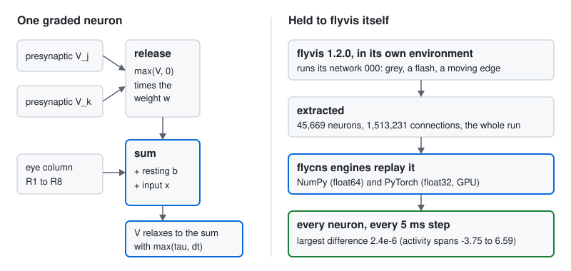

# The graded visual neurons

Most neurons of the fly's lamina and medulla do not fire spikes. They signal with graded changes of membrane
potential and release transmitter continuously, and a model in which they spike does not carry vision past the
lamina. `flycns.dynamics.graded` runs them as flyvis does. flyvis is the connectome-constrained model of the fly
visual system of Lappalainen et al. (*Nature* 2024, doi:10.1038/s41586-024-07939-3; code MIT,
`TuragaLab/flyvis`). Trained end to end on optic flow, it develops ON and OFF pathways and direction-selective T4 and
T5 cells, and its predictions agree with measurements from 26 studies. flycns carries the trained numbers of its 50
pretrained networks and reproduces flyvis's own computation on flyvis's own network, neuron for neuron.

## What is real, what is modelled

| Part | Where it comes from | Status |
|---|---|---|
| The cell types, which pairs connect, their signs, their mean synapse counts by columnar offset | flyvis's connectome (the FIB-25 and FIB-19 reconstructions, averaged into one column's filters) | real, averaged |
| The neuron: a passive point, graded release, one time constant | flyvis's `PPNeuronIGRSynapses` | modelled, published |
| A resting potential and time constant per type, a unitary strength per pair of types | trained by flyvis on optic flow; 50 networks | trained, published |

This release runs flyvis's own lattice (721 columns, 45,669 neurons). The next one puts the same parameters onto the
neuron-level wiring of the MaleCNS optic lobes, where the columns, the cells and the synapse counts are the
release's own.

## The dynamics

Each neuron $i$ has one voltage $V_i$:

$$\tau_i^\text{eff}\,\frac{dV_i}{dt} = -V_i + b_i + \sum_j w_{ij}\,\max(V_j, 0) + x_i(t), \qquad
\tau_i^\text{eff} = \max(\tau_i, \Delta t),$$

integrated by forward Euler, $V \leftarrow V + \Delta t\,\dot V$. A presynaptic neuron releases in proportion to its
voltage above zero (the rectifier $\max(V, 0)$), instantly; $b_i$ is the resting potential of the neuron's type,
$\tau_i$ its time constant, and $x_i$ the stimulus intensity, which reaches the photoreceptors R1 to R8 of the
neuron's column (the same value for all eight) and nothing else. The weight of a connection is

$$w_{ij} = \sigma_{t_j t_i}\; N_{t_j t_i}(\Delta u, \Delta v)\; \alpha_{t_j t_i},$$

the sign of the pair of types $\sigma$ (fixed, from the literature), the mean synapse count $N$ of the pair at the
columnar offset from the presynaptic to the postsynaptic column (fixed), and the unitary strength $\alpha$ of the pair
(trained, never negative). The state starts at the resting potentials and reaches its steady state in two seconds of
uniform grey (intensity 0.5); flyvis trains with $\Delta t$ = 1/50 s and evaluates with 1/200 s.

<picture>
  <source media="(prefers-color-scheme: dark)" srcset="../assets/graded-dark.svg">
  
</picture>

## The 50 trained networks, measured

`flycns.flyvis.load_ensemble()` returns the 50 networks' numbers, in flyvis's own order:

- per type (65, R1 to TmY18): a resting potential and a time constant; per pair of types (604): a strength and a
  sign (376 excitatory, 228 inhibitory); per pair and columnar offset (2,355 groups): a mean synapse count. Signs and
  counts are identical in all 50 networks, as training never changes them.
- 73.7% of the trained time constants lie below the 20 ms training step, where they acted as 20 ms. The slow types
  are C2 (median 239 ms across networks), Tm2 (136 ms) and C3 (67 ms).
- Resting potentials range from -1.41 to 2.63 (median 0.53).
- A pair's strength times its mean count has a median of 0.036 (10th to 90th percentile: 0 to 0.29); 3% of the
  strengths are zero.
- The networks disagree: a pair's strength has a median coefficient of variation of 1.20 across the 50. Every result
  flycns reports from these parameters is therefore reported over the ensemble.

The numbers come from `scripts/extract_flyvis_ensemble.py`, run once in a separate environment with flyvis 1.2.0. It
reads the orders from flyvis's own parameter objects, checks them against the values the network uses, and records
the SHA-256 of all 50 checkpoints. flyvis's MIT licence ships next to the data.

## Held to flyvis itself

The same script runs flyvis's network 000 on a fixed stimulus and keeps the run: two seconds of grey to the steady
state, then a full-field flash from 0.5 to 1.0 between 100 and 300 ms, then an ON edge sweeping the lattice at one
column per 20 ms from 400 ms, every neuron recorded at every 5 ms step. Both engines replay the network from the
same resting potentials:

| Engine | Arithmetic | Largest difference from flyvis over 45,669 neurons and 200 steps | Time for the run |
|---|---|---|---|
| `GradedReference` (NumPy) | float64 | 2.4e-6 (steady state: 2.2e-6) | 11 s |
| `GradedTorch` (PyTorch, laptop GPU) | float32 | 1.4e-6 (steady state: 7.2e-7) | 0.7 s |

The activity spans -3.75 to 6.59 in that run, so the differences are the rounding of flyvis's own float32
arithmetic. Network 000's weights, rebuilt from the shipped numbers (sign times the mean count at the offset times
the strength), match flyvis's to 1e-7, and its resting potentials and time constants match exactly.

## Tests

| Requirement | Test | What it checks |
|---|---|---|
| R-401 | `tests/test_graded_parity.py::test_reference_reproduces_flyvis_on_its_own_network` | the NumPy engine against flyvis's run, every neuron and step, within 1e-5 |
| R-402 | `tests/test_graded_parity.py::test_torch_engine_matches_the_reference_on_flyvis` | the PyTorch engine against flyvis and the reference, within 1e-5 |
| R-403 | `tests/test_flyvis_ensemble.py::test_ensemble_ships_with_its_provenance_and_order` | network 000 rebuilt from the shipped numbers, weight by weight |
| R-404 | `tests/test_graded.py::test_one_step_is_the_published_formula` | one step against the formula written neuron by neuron |

## Sources

- Lappalainen J. K., Tschopp F. D., Prakhya S., McGill M., Nern A., Shinomiya K., Takemura S., Gruntman E., Macke J.
  H., Turaga S. C. Connectome-constrained networks predict neural activity across the fly visual system. *Nature*
  (2024). doi:10.1038/s41586-024-07939-3. Code and pretrained networks: `TuragaLab/flyvis` 1.2.0, MIT.
