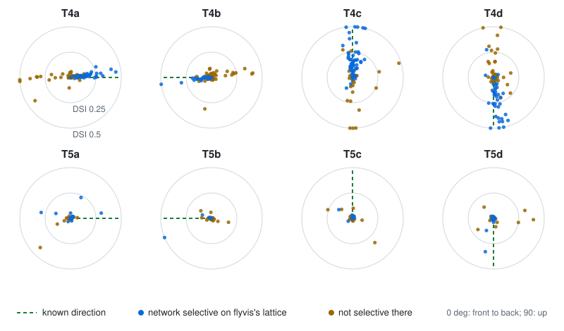

# The optic lobes of MaleCNS, graded

The flyvis networks ([`03_graded.md`](03_graded.md)) learned their numbers on one averaged column. `flycns.optic_lobe`
puts those numbers onto the neuron-level wiring of both MaleCNS optic lobes: 95,925 real neurons, each its own graded
unit, joined by the release's own 9.07 million connections. The question this page answers is what that real wiring
computes with the trained numbers, and the answer is measured, network by network, against what flyvis's own network
computes on its lattice.

## What is real, what is transferred, what is added

| Part | Where it comes from | Status |
|---|---|---|
| The neurons, their types, which pairs connect and with how many synapses | MaleCNS v1.0 | real |
| Each type's resting potential and time constant; each pair's strength per synapse | flyvis's trained networks (one of 50 at a time) | transferred |
| A cap on each neuron's drive from each presynaptic class | flyvis's per-column synapse counts | added, stated |
| The drive of the 69% of synapses flyvis has no number for | flyvis's initialisation scale | added, stated |
| 4,873 stand-in photoreceptors, flagged | the medians of complete columns | added where the reconstruction is incomplete |
| CT1 as 3,536 per-column compartments | flyvis's own model of CT1 | transferred |
| Each column's viewing direction; the direction of neurons the release gives no column | the eye model; the columns of their inputs | modelled |

## The transfer, rule by rule

**Classes.** 49 of flyvis's 65 types exist in MaleCNS under the same name. Photoreceptors pool into R1-R6 (the release
does not tell R1 from R6), R7 and R8 (each of their pale, yellow and dorsal-rim subtypes is one flyvis type);
TmY9a and TmY9b stand for flyvis's TmY9. flyvis's Am, Mi3, Mi11, Mi12 and Tm28 have no counterpart by name, and
MaleCNS's Am1 is not flyvis's lamina amacrine: it receives no synapse from R1-R6, where flyvis's Am receives 227 per
column.

**Strength per synapse, capped per neuron.** The two datasets count synapses on one scale: over the 551 pairs both
have, the median ratio of MaleCNS's synapses per target to flyvis's, weighted by flyvis's drive, is 1.08 (Mi1 onto
T4a: 68.4 against 68.0). So every synapse of a mapped pair carries flyvis's trained strength, and the release's
pair-by-pair differences stay. Three measured failures set the cap:

1. Scaling every pair to flyvis's average drive concentrates the drive of pairs the release barely has on their few
   synapses: one connection weighed 1,528.
2. Trained strengths on the release's synapses as they are drive the network to infinity within 100 ms of grey:
   TmY4 onto TmY4 is seven times denser in MaleCNS than in flyvis's column (a drive per target of 2.5 against 0.37,
   a loop gain above one). flyvis's seven-column reconstructions under-count lateral wiring.
3. Capping each pair's average only delays the divergence to 700 ms, through the T5d cells that receive several
   times their class's average.

Each neuron's drive from each presynaptic class is therefore capped at flyvis's: a neuron that receives ``c``
synapses from a class for which flyvis's column has ``N``, with ``c > N``, has those synapses scaled by ``N / c``:

$$w_{ij} = \sigma_{ST}\; n_{ij}\; \alpha_{ST}\; \min\!\left(1, \frac{N_{ST}}{c_{iS}}\right),
\qquad c_{iS} = \sum_{j' \in S} n_{ij'} .$$

The cap binds on 68% of the transferred synapses of network 000. Scaling up as well as down (every neuron exactly at
flyvis's drive) was measured too, and 47 of the 50 networks then diverge.

**CT1.** flyvis models CT1 as one medulla (M10) and one lobula (Lo1) compartment per column, electrically separate;
MaleCNS has one CT1 per side. Each CT1 connection moves to the compartment of its partner's column, of the kind flyvis
pairs the partner's type with. As a single unit, CT1 sums every column and carries the eye-wide average, and the T5
cells it inhibits locally lose most of their direction selectivity; split, they recover it (below).

**Every other connection** carries flyvis's initialisation scale: each neuron receives from each class flyvis has no
number for a total drive of ``0.01 x 2`` (the strength scale times flyvis's median number of columnar offsets per
pair), spread over that class's synapses, with the transmitter's sign. These are 69% of the synapses; their classes
take flyvis's initial resting potential (0.5) and the network's median time constant.

**Stand-in photoreceptors.** 945 of the 1,771 columns have no reconstructed R1-R6 terminal, 585 no R7 and 450 no R8.
Where a column's photoreceptors deliver fewer synapses onto a columnar neuron of that column than complete columns
do (the median of the 240 columns with six R1-R6: 211.5 synapses onto L1, 221 onto L2, 37.5 onto L3), one flagged
stand-in per column and group supplies the difference and sees the column's light: 1,712 for R1-R6, 1,506 for R7 and
1,655 for R8. Light then reaches 10,768 photoreceptors, 5,895 of them real.

**Where the neurons without a column look.** The release places L1, Mi1, Tm1 and other columnar types in columns,
but not T4, T5, Tm3, T2 or the TmY cells. Their viewing direction is the synapse-weighted mean direction of their
presynaptic partners' columns, over as many rounds as it takes second-order cells to inherit one.

## The measurement

flyvis's measures of direction selectivity, reproduced exactly on its lattice (DSI within 1e-7, preferred direction
within 0.0006 degrees wherever flyvis's DSI exceeds 0.01, networks 000 to 004): the peak rectified response while an
edge crosses the neuron; the DSI, the length of the vector sum over 12 directions of the peaks divided by the larger
of the ON and OFF sums, averaged over speeds; the preferred direction, the vector sum's angle. On MaleCNS, full-field
ON and OFF edges at flyvis's three fastest speeds (13, 19 and 25 columns per second of 5.8 degrees) cross each
modelled eye from the grey steady state, and every T4 and T5 cell whose viewing direction lies within 15 degrees of
the eye's centre is measured: about 210 cells per eye, 23 to 30 of each subtype. T4 cells answer ON edges and T5 cells
OFF edges; the known preferred directions are front to back (a), back to front (b), up (c) and down (d) (Maisak et
al., *Nature* 500:212-216, 2013, doi:10.1038/nature12320).

## The eye model's error, and its correction

The first measurement found every T4 subtype on both eyes preferring its known direction turned by about +65 degrees.
A shared rotation of all four subtypes points at the eye model, not the wiring, and the dorsal rim showed it
independently: its centroid sat 47 to 53 degrees from straight up. The medulla sits obliquely in the head, so the axis
that runs dorsally in the medulla is not the eye's vertical; the eye model now sets the vertical by the dorsal rim
([`01_eyes.md`](01_eyes.md)), and the T4 cells, measured again, prefer their known directions within about 10 degrees.

## What the real wiring computes

All 50 flyvis networks, each transferred and measured on both eyes, and each also measured on its own lattice with
the same measures (`scripts/measure_optic_lobe.py`; the numbers below come from `scripts/summarise_optic_lobe.py`
over its results):

| Subtype | Networks whose own cell is selective with the known direction (lattice DSI above 0.1, within 45 degrees) | Of those, within 45 degrees on both MaleCNS eyes | Their median error on MaleCNS | Median DSI, MaleCNS | Median DSI, lattice |
|---|---|---|---|---|---|
| T4a | 24 | 23 | 8 deg | 0.083 | 0.400 |
| T4b | 13 | 12 | 8 deg | 0.030 | 0.171 |
| T4c | 31 | 25 | 11 deg | 0.100 | 0.585 |
| T4d | 23 | 18 | 11 deg | 0.069 | 0.504 |
| T5a | 14 | 5 | 43 deg | 0.004 | 0.044 |
| T5b | 4 | 3 | 23 deg | 0.004 | 0.097 |
| T5c | 7 | 2 | 66 deg | 0.003 | 0.044 |
| T5d | 14 | 5 | 44 deg | 0.007 | 0.084 |

<picture>
  <source media="(prefers-color-scheme: dark)" srcset="../assets/t4t5-directions-dark.svg">
  
</picture>

**T4 survives the transfer.** In 78 of the 91 cases (86%) where flyvis's own network has a selective T4 subtype with
the known direction, the same subtype on the real MaleCNS wiring, seen through the modelled eyes, prefers the known
direction within 45 degrees on both eyes, with a median error of 8 to 11 degrees. Its selectivity is weaker than on
the lattice (median DSI 0.03 to 0.10 against 0.17 to 0.59): each MaleCNS T4 cell carries its own neighbourhood of
inputs, not an average one.

**T5 mostly does not.** Only 15 of the 39 selective cases (38%) keep the known direction, and T5 selectivity on
MaleCNS is small (median DSI 0.003 to 0.007). flyvis's own T5 is also weaker than its T4 under these measures (lattice
medians 0.04 to 0.10). Splitting CT1 into compartments restored T5 in some networks (network 000's right eye: T5a
DSI 0.31, T5b 0.74, T5d 0.34, within 10 to 22 degrees); in most it did not, and what T5 needs that the transfer
lacks is open: the Tm cells flyvis has no counterpart for (Tm28, and the Mi and Am types above), the capped drive of
T5's many inputs, or the real wiring itself.

**Stability.** Under 20 seconds of uniform grey, 41 of the 50 transferred networks stay below 1,000 in every unit
(median peak 17.2), against 49 of flyvis's own networks on its lattice (median peak 25.8); 2 transferred networks
diverge. No network is stable on MaleCNS and unstable on the lattice. flyvis's own networks do not settle either:
after flyvis's two-second steady state, the median lattice network still drifts by 0.63 per second, and 3 grow over
20 seconds. The instability is part inherited, part the real wiring's; the product reports which networks are stable.

## Limits

- One CT1 cell per side, split by partner column: the split follows flyvis's model of CT1, not a measured
  compartmentalisation of this animal's CT1.
- 69% of the synapses carry a stated prior, not trained numbers; the classes they join are not in flyvis's model.
- Neurons without a column take their position from their inputs; a neuron with inputs from two distant regions sits
  between them.
- The stand-ins supply median synapse counts; where a real terminal is missing because it was not reconstructed, and
  not because it is absent, the stand-in is right; the release does not say which.

## Sources

- Lappalainen J. K. et al. Connectome-constrained networks predict neural activity across the fly visual system.
  *Nature* (2024). doi:10.1038/s41586-024-07939-3. flyvis 1.2.0, MIT.
- Maisak M. S. et al. A directional tuning map of Drosophila elementary motion detectors. *Nature* 500:212-216 (2013).
  doi:10.1038/nature12320.
- Berg S. et al. *Cell* 189(18):5504-5526.e15 (2026). doi:10.1016/j.cell.2026.08.015: MaleCNS v1.0.
