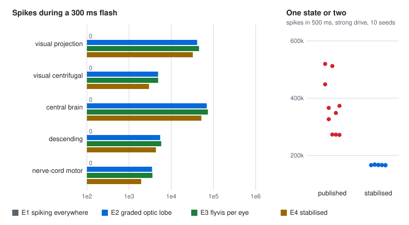

# The whole CNS, coupled: engines E1 to E4

The optic lobes compute with graded voltages; the rest of the published model spikes. `flycns.dynamics.hybrid`
joins them through the release's own synapses, both ways, so light entering the modelled eyes can reach the motor
neurons of the nerve cord. Four engines answer four questions:

| Engine | What runs where | The question it answers |
|---|---|---|
| E1 | the published LIF everywhere; light as Poisson input to photoreceptors | does the published model, unchanged, see? |
| E2 | the transferred graded optic lobes (part 2) plus the LIF | does the real wiring, with flyvis's numbers, carry vision into the CNS? |
| E3 | flyvis's own network per eye, mapped onto the MaleCNS neurons, plus the LIF | does the trained model's activity, delivered through the real outputs, reach the CNS? |
| E4 | E2 with flyverse's stabilisers | what do the stabilisers change? |

## The coupling

Graded neurons run every 5 ms (flyvis's step, at which the engines match flyvis to 2.4e-6), spiking neurons every
0.1 ms. Of the release's 25.6 million connections, 13.76 million join spiking neurons, 1.94 million run from graded
to spiking neurons and 0.83 million the other way.

**Graded to spiking (the bridge).** A graded neuron releases transmitter continuously. Its release above the grey
steady state acts on each spiking target as a spike train of rate $\beta D$ would:

$$D_j = \max(V_j, 0) - \max(V_j^{\text{grey}}, 0), \qquad
\frac{dg_i}{dt} \mathrel{+}= \beta \sum_{j \in \text{graded}} D_j\, s_j\, n_{ij}\, w_\text{syn},$$

added in the synapses slot of each LIF step for neurons that are not refractory, like any synaptic input. At grey
nothing reaches the spiking CNS, as the published model fires nothing without input. $\beta$ (spikes per second per
unit of release, 100) is the free parameter every hybrid in the survey has.

**Spiking to graded (feedback).** A spiking neuron acts on a graded target as release of $r/\beta$, with $r$ its rate
filtered by the published synaptic time constant (5 ms); each graded target receives from each class of spiking
presynaptic neurons flyvis's initialisation drive ($0.01 \times 2$), spread over the class's synapses, with the
transmitter's sign.

Both are checked against their closed forms on a toy CNS: a target's voltage settles exactly where the exact LIF step
puts it under the bridge's drive (with $g$ topped up once per step, $v - v_0 = G\,c/(1-a)$, $G = I\,\Delta t/(1-b)$),
and a centrifugal cell firing at 200 Hz lowers a lamina cell by $0.02 \times 200/100$.

## A flash, through each engine

200 ms of grey (the steady state every engine starts from), then 300 ms of full intensity on every column of both
eyes:

<picture>
  <source media="(prefers-color-scheme: dark)" srcset="../assets/whole-cns-dark.svg">
  
</picture>

| Spikes during the flash | E1 | E2 | E3 | E4 |
|---|---|---|---|---|
| photoreceptors | 515,213 | graded | graded | graded |
| visual projection neurons | 0 | 41,019 | 45,558 | 32,455 |
| central brain | 0 | 69,378 | 73,948 | 51,777 |
| descending neurons | 0 | 5,455 | 5,783 | 4,330 |
| nerve-cord motor neurons | 0 | 3,500 | 3,584 | 1,938 |

Every engine is silent at grey outside the photoreceptors.

**E1 does not see.** The photoreceptors fire and not one other neuron does. Photoreceptors are histaminergic, so the
published sign rule makes them inhibitory; the lamina neurons they synapse on are silent spiking neurons, and
inhibiting a silent spiking neuron changes nothing. In the fly the lamina's neurons are graded and signal precisely by
being hyperpolarised. This is the flyverse project's finding that a spiking lamina does not propagate, with its
mechanism. It is the reason the optic lobes are graded in E2 to E4.

**E2 and E3 carry the flash into the whole CNS**, to the motor neurons, at similar strength: the real wiring with
flyvis's numbers (E2) and flyvis's own network delivered through the real outputs (E3) agree at this level. E3 maps
72,414 MaleCNS neurons onto flyvis's lattices; 5,417 look outside the lattice's 15 rings and stay at grey.

**The bridge's free parameter** changes how much, not whether: over $\beta$ from 25 to 400, the visual projection
neurons' spikes during the flash grow nearly in proportion (8,382 to 133,641) and the motor neurons' far less (2,624
to 5,036); light reaches the motor neurons at every value.

## What the stabilisers do

E4 adds flyverse's stabilisers to the spiking part, in a stated order: each connection capped at 60
synapse-equivalents; same-type connections scaled by 0.1; every neuron whose input then exceeds 5,000
synapse-equivalents scaled down to it; spike-frequency adaptation of 1.5 mV per spike, decaying with 200 ms.

On the published model alone under the strong gustatory drive (all 1,428 gustatory neurons at 150 Hz), the ten
seeds' 500 ms totals spread from 271,834 to 519,691 spikes: each run either stays in the low state or switches, at a
random moment, into the high state carried by the mushroom-body loop ([`02_lif.md`](02_lif.md)). With the stabilisers
they lie between 165,430 and 168,527: one state. Under the flash, E4 carries less than E2 (1,938 motor-neuron spikes
against 3,500), and still carries it all the way.

## Tests

| Requirement | Test | What it checks |
|---|---|---|
| R-421 | `tests/test_hybrid.py::test_the_bridge_and_the_feedback_have_their_closed_forms` | the bridge and the feedback against their closed forms; silence at grey |
| R-422 | `tests/test_hybrid.py::test_the_torch_hybrid_matches_the_reference` | GPU against NumPy, spike for spike |
| R-423 | `tests/test_stabilisers.py::test_stabilisers_do_what_they_state` | adaptation; modulated input equal to the published activation |
| R-424 | `tests/test_stabilisers.py::test_stabilised_weights_cap_damp_and_normalise` | the weights, in order |
| R-425 | `tests/test_mapped.py::test_flyvis_t4a_prefers_front_to_back_in_the_eyes_frame` | E3's lattice geometry and frame mirror |
| R-426 to R-429 | `tests/test_whole_cns_data.py` | the four engines on the whole MaleCNS, as above |

## Sources

- Shiu P. K. et al. *Nature* 634:210-219 (2024). doi:10.1038/s41586-024-07763-9: the published LIF.
- Lappalainen J. K. et al. *Nature* (2024). doi:10.1038/s41586-024-07939-3: flyvis.
- flyverse (tel-0s): the stabilisers and the finding that a spiking lamina does not propagate (the plan's dossier
  01, section 2.14); its constants are used as its authors state them.
