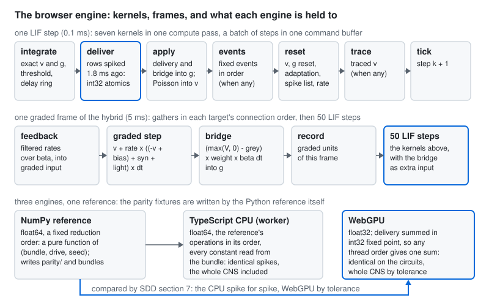

# The browser engine

`@fasl-work/flycns`, the npm package, runs the same dynamics as the Python package in a browser: the published LIF,
the graded optic lobe and the hybrid, on the CPU in TypeScript and on the GPU through WebGPU. Both are held to the
Python reference by parity fixtures that the reference itself writes. The engine produces spikes and voltages; drawing
them is Destello's job, not this package's.

<picture>
  <source media="(prefers-color-scheme: dark)" srcset="../assets/browser-engine-dark.svg">
  
</picture>

## What the package holds

| Part | Module | What it does |
|---|---|---|
| Loaders | `compiled`, `recording`, `bundle` | read the compiled format, recordings and engine bundles; every array is checked against the SHA-256, dtype and shape in its manifest before use |
| Counter-based randomness | `rng`, `HASH_WGSL` | MurmurHash3_x86_32 of (neuron, step) in TypeScript and in WGSL, the same bits as `flycns.rng` |
| CPU engines | `LIFEngine`, `GradedEngine`, `HybridEngine` | float64, the reference's operations in the reference's order |
| GPU engines | `LIFGpu`, `GradedGpu`, `HybridGpu` | WebGPU compute, float32, the LIF delivery summed in int32 fixed point |
| Worker | `createWorkerHandler`, `@fasl-work/flycns/worker` | runs a CPU engine off the page's main thread when there is no WebGPU |

## The contract between the two languages

Python derives what an engine runs (the weights, the optic-lobe units, the bridge and the feedback), and writes it as an
**engine bundle** (schema `flycns.engine/1`): a directory in the compiled style holding the arrays an engine steps
over and, in its manifest, every constant the step uses as a JSON number. A float written by Python's `json` and read
by `JSON.parse` round-trips exactly, so the TypeScript engine never recomputes an exponential the reference computed
(`Math.exp` and `math.exp` may differ in the last place). A **scenario** (schema `flycns.scenario/1`) adds one run:
the drive, the stimulus, the seed, the lead-in and the neurons to trace; its `expected/` directory is the reference's
output. The fixtures under `parity/` are eight scenarios and 10,005 hash keys, regenerated by
`scripts/make_parity_fixtures.py` and checked current by a Python test.

## The CPU engine: the reference, operation for operation

The NumPy reference is a pure function of (bundle, drive, seed) in float64 with a fixed reduction order, so an engine
that performs the same double-precision operations in the same order gives the same bits. The rules that make it
hold, each caught by a fixture while the engine was written:

- deliveries are accumulated into a zeroed array in the reference's order (spiking neurons ascending, each row in CSR
  order) and only then added to $g$, as `np.bincount` sums its weights in input order;
- every constant the reference computes with an exponential or a division (the decay factors $a$, $b$, $c$ of the
  exact step, the rate decay of the hybrid, the lead-in's step count) is read from the bundle;
- Poisson thresholds follow the reference's two expressions, $\lfloor r\,(\Delta t/1000)\,2^{32} \rfloor$ for activation
  and $\lfloor (r\,\Delta t)/1000 \cdot 2^{32} \rfloor$ for modulated rates, because the two roundings differ;
- the graded step is $V + \frac{1}{\max(\tau, \Delta t)}\left(\left((-V + b) + \textstyle\sum_j w_{ij} \max(V_j, 0)\right) + x\right)\Delta t$,
  with the sums in that order;
- traces are rounded to float32, as the reference stores them.

The exact LIF step these rules protect is the one of [`02_lif.md`](02_lif.md):

$$g \leftarrow g\,b, \qquad v \leftarrow v_0 + (v - v_0)\,a + g\,c, \qquad
a = e^{-\Delta t/\tau_m},\; b = e^{-\Delta t/\tau},\; c = \frac{\tau}{\tau - \tau_m}\left(e^{-\Delta t/\tau} - e^{-\Delta t/\tau_m}\right),$$

for neurons that are not refractory, followed by the threshold, the delivery, the events and the resets in Brian2's
order.

## The WebGPU engine

**One LIF step is seven kernels in one compute pass**, each dispatch seeing the previous one's writes: *integrate*
(the exact step for free neurons, the threshold, the spike flag written into a ring of $t_\text{dly}/\Delta t + 1$
slots, unless the neuron is silenced), *deliver* (each neuron that spiked $t_\text{dly}$ ago pushes its CSR row into
per-neuron accumulators), *apply* (the delivery and the hybrid's bridge into $g$, then Poisson and modulated events
into $v$, all for free neurons only), *events* (the step's fixed events, in order, by one invocation, dispatched only
on steps that have any), *reset* (resets, adaptation, the spike appended to the batch's list, the filtered rate the
feedback reads), *trace* and *tick* (the step counter, so a batch of steps is one command buffer). A step counter on
the device, rather than a uniform per step, lets 500 steps go to the GPU in one submission; spikes and traces are read
back once per batch and sorted by (step, neuron) on the CPU.

**The delivery is an integer sum.** Threads push their rows with `atomicAdd` in whatever order the GPU schedules
them. Floating-point addition depends on order; integer addition does not. The weights are therefore put on a
fixed-point grid once, on the CPU:

$$S = 2^{\left\lfloor \log_2 \left( 2^{30} \big/ \max_i \sum_j |w_{ij}| \right) \right\rfloor}, \qquad
\hat w_{ij} = \operatorname{round}(w_{ij} S), \qquad
\Delta g_i = S^{-1} \sum_{j\ \text{due}} \hat w_{ij}.$$

Because every neuron's largest possible input, all its presynaptic neurons firing at once, stays within $2^{30}$, the
int32 sum cannot overflow; because $S$ is a power of two, $S^{-1}$ is exact; and each delivered weight is off by at
most $1/(2S)$. On MaleCNS $S = 2^{14} = 16{,}384$, so the error is at most $3.1 \times 10^{-5}$ mV per connection
against weights that are multiples of 0.275 mV.

**The graded step gathers.** Each graded neuron sums its incoming connections itself, over a CSR by target built on
the CPU that keeps each target's connections in their original order, which is the order the CPU engine sums them in.
The step needs no atomics and no bound on the activity (a fixed-point grid would need one), and it reads the previous
state while writing the next into a second buffer. The bridge, the feedback and the lattice source's map onto the
lobe's units are the same kind of gather, one kernel with a mode: the bridge multiplies its sum by $\Delta t_\text{LIF}$,
the feedback divides by $\beta$, and the map accumulates side after side as the CPU engine does.

**One hybrid frame** is, in one command encoder: the feedback gathered from the filtered rates, the frame's light
copied into the lobe's input, the graded step, the deviation from grey and the bridge into the LIF's extra input, the
record of the graded units, then the frame's 50 LIF steps. Twenty frames share a command buffer.

Each kernel binds at most seven storage buffers, under WebGPU's default of eight per stage, and the device is
requested with the adapter's largest buffer limits, since the whole CNS needs bindings of about 100 MB.

## What the parity fixtures give

Measured 2026-09-26 on a laptop RTX 4070 through Dawn (D3D12), the WebGPU runs with batches of 97 steps so that batch
boundaries fall inside delays and events:

| Fixture | Reference | TypeScript CPU | WebGPU |
|---|---|---|---|
| three Brian2-checked circuits, fixed events | 98, 106 and 100 spikes | identical spikes and traces | identical spikes; traces within 6.1e-5 mV |
| Poisson activation, modulated rates, silencing | 297 spikes | identical | identical spikes; traces within 5.0e-5 mV |
| adaptation | 319 spikes | identical | identical spikes; traces within 6.6e-4 mV |
| a random graded network over random frames | 60 frames | identical activity | activity within 3.6e-7 |
| the toy CNS, the lobe's own source | 49 spikes, 100 frames | identical spikes and activity | identical spikes; activity within 2.4e-7 |
| the toy CNS, flyvis's lattices as source | 49 spikes, 100 frames | identical spikes and activity | identical spikes; activity within 6.0e-8 |

The WGSL hash equals the reference on the five pinned vectors and the 10,005 committed keys.

## What it gives on the whole CNS

`scripts/write_whole_cns_scenario.py` writes the published LIF on the whole MaleCNS v1.0 (166,700 neurons, 25,582,938
connections, weights exact) with its reference output; `scripts/measure_browser.mjs` runs both browser engines on it.

**Moderate drive** (the 57 gustatory neurons of types LB1a to LB1e at 150 Hz), 200 ms:

| Engine | Spikes | Agreement with the reference | Time for 200 ms |
|---|---|---|---|
| NumPy reference | 18,063 from 5,120 neurons | | 1.6 s |
| TypeScript CPU | 18,063 | identical, spike for spike | 1.5 s |
| WebGPU | 18,063 | the same neurons the same number of times: Jaccard 1.0, count correlation 1.0 | 0.4 s (setup 0.3 s) |

The WebGPU spike order parts from the reference at step 1,112, after 6,281 spikes: the first threshold that float32
and float64 decide differently, where the PyTorch engine parts too (about 6,300 spikes, [`02_lif.md`](02_lif.md)).
From there the two are samples of one process, which is why the SDD compares them by the neurons and counts, with a
floor of 0.98.

**Strong drive** (the 1,428 neurons of the gustatory class at 150 Hz), 500 ms, where the network may switch into its
high state at a random moment: the reference's ten seeds fire from 269,642 to 522,875 spikes. Five WebGPU runs (seeds
0 to 4: 518,665, 323,254, 533,224, 477,048 and 272,162 spikes) correlate with five reference runs (seeds 5 to 9) at
0.9836 in mean rate, against a 5th percentile of 0.8908 (median 0.9832) for the reference against itself over the
126 splits of its ten seeds. One TypeScript run (seed 0) gives the reference's seed-0 counts for every neuron, 521,583
spikes in 4.2 s.

## Limits

- GPU results are compared by tolerance and never claimed bit-identical: float32 state, the float32 exponentials of
  the kernels, and a delivery rounded to $1/S$.
- The GPU tests need a WebGPU adapter. Node reaches one through Dawn (`npm install --no-save webgpu`, 95 MB, not a
  dependency); CI has no GPU, so there the GPU tests are reported as skipped, never as passed, and they run on the
  developer's machine before a release that touches the kernels. The Dawn instance must stay referenced for the life of
  the process: when it is garbage-collected the device is torn down and the process crashes.
- A batch's spike list has a fixed capacity (by default the neurons times the batch's steps, at most 4,194,304); a
  batch that fires more stops the run with an error rather than dropping spikes.
- A large bundle may carry `lif_weight_mv` as float32 to halve its size; runs on it then differ from an exact bundle's
  by that rounding as well.

## Using it

```ts
import { fetchSource, loadBundle, LIFGpu, requestDevice } from "@fasl-work/flycns";

const bundle = await loadBundle(fetchSource("https://example.org/bundles/malecns-lif/"));
const device = await requestDevice(); // navigator.gpu
const engine = LIFGpu.fromBundle(device, bundle);
const run = await engine.run(2000, { activate: new Map([[1234, 150]]) }, 0);
// run.tickIndptr and run.neuronIndex: the spikes of each step, as the Python Run stores them
```

Without WebGPU, `lifFromBundle(bundle).run(...)` gives the same run on the CPU, and
`new Worker(new URL("@fasl-work/flycns/worker", import.meta.url), { type: "module" })` runs it off the main thread.

## References

- Shiu, P. K. et al. A Drosophila computational brain model reveals sensorimotor processing. *Nature* 634, 210-219
  (2024). doi:10.1038/s41586-024-07763-9
- Lappalainen, J. K. et al. Connectome-constrained networks predict neural activity across the fly visual system.
  *Nature* (2024). doi:10.1038/s41586-024-07939-3
- W3C. WebGPU, and the WebGPU Shading Language (WGSL). https://www.w3.org/TR/webgpu/ and https://www.w3.org/TR/WGSL/
- Appleby, A. MurmurHash3 (public domain). https://github.com/aappleby/smhasher
